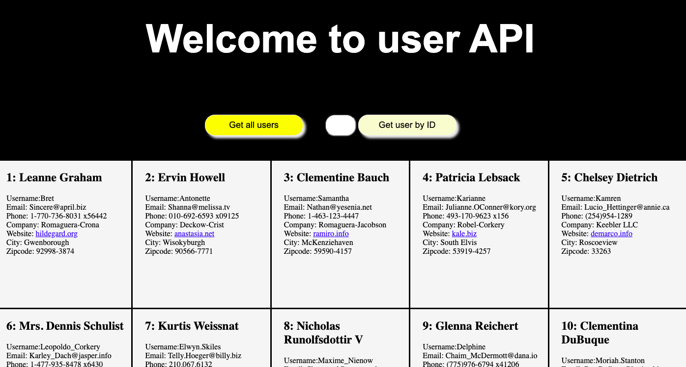

# User API

> is a small individual project.
> It allows to get user information from the URL'https://jsonplaceholder.typicode.com/users'.

## Table of contents

- [User API](#user-api)
  - [Table of contents](#table-of-contents)
  - [General info](#general-info)
  - [Screenshots](#screenshots)
  - [Technologies](#technologies)
  - [Setup](#setup)
  - [Code Examples](#code-examples)
  - [Features](#features)
  - [Status](#status)
  - [Inspiration](#inspiration)
  - [Contact](#contact)

## General info

The objective is to practice 'Asynchronous Programming' and 'Separation of concerns'.

## Screenshots



## Technologies

- JavaScript
- HTML
- CSS
- VSC code
- Node JS

## Setup

- By clicking on "Get all users" button you can see the list of all users

- In order to get a user by specific ID you need to input Id and click on button
- Your input is limited by numbers from 1 to 10 since there are ten users

## Code Examples

```js
import { showUsers } from "../components/add-div.js";
import { findUser } from "../utils/filter.js";


export const getUsers = () => {
 fetch('https://jsonplaceholder.typicode.com/users')
  .then((res) => {
   if (res.status === 200) {
    return res.json();
   }
  })
  .then((data) => showUsers(data))
  .catch((err) => console.error(err));
};

export const getUser = () => {
 fetch('https://jsonplaceholder.typicode.com/users')
  .then((res) => {
   if (res.status === 200) {
    return res.json();
   }
  })
  .then((data) => findUser(data))
  .then((user) => showUsers(user))
  .catch((err) => console.error(err));
};

```

## Features

List of features ready and Todos for future development

- Button to show all users in the list
- Input field to get a user by its ID
- Button to show selected user
- Notification is input is not valid

To-do list:

- Message if user id doesn't exist in the database

## Status

Project is: _in progress_

## Inspiration

Inspired by HYF coach @Samir

## Contact

By [@MMikhailova]
